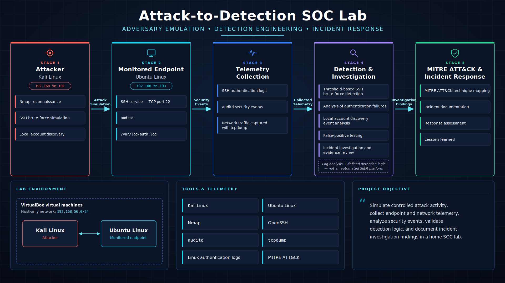
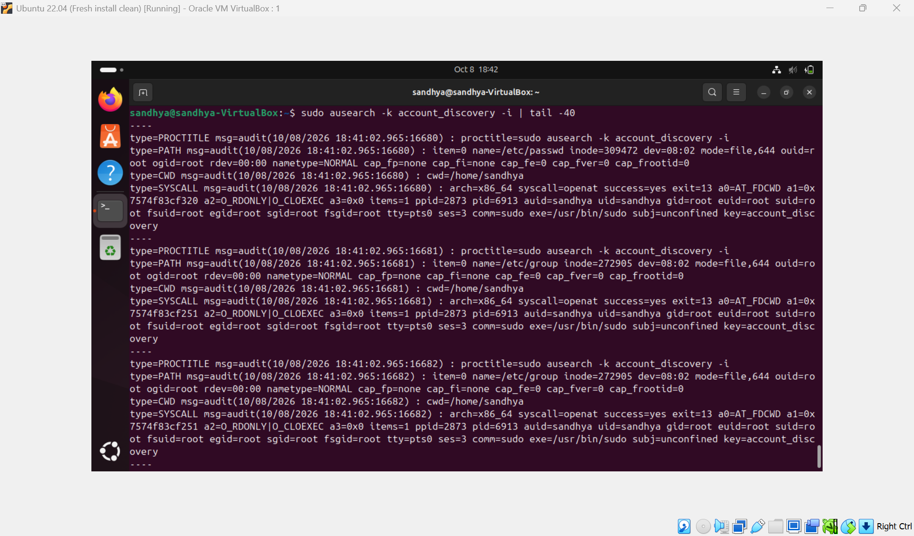
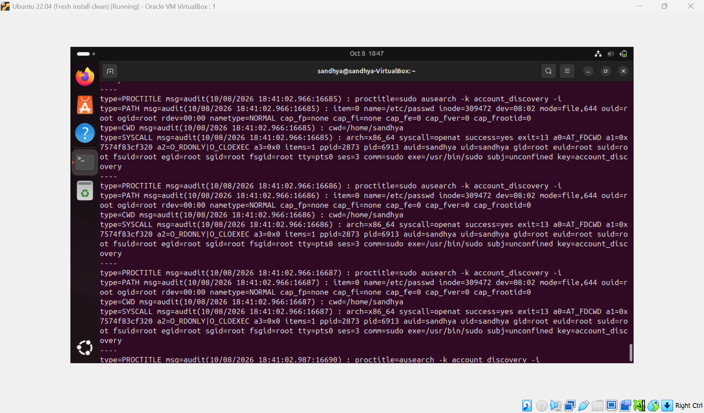
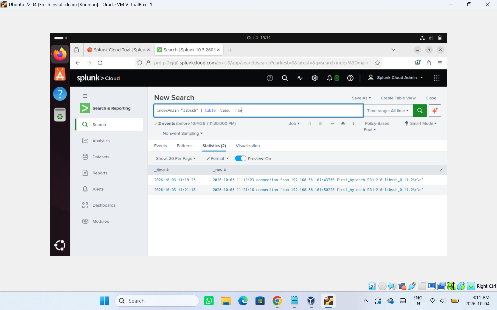

# Attack-to-Detection SOC Lab

**Adversary Emulation | Detection Engineering | SIEM Log Analysis | Incident Investigation**

A hands-on cybersecurity portfolio project demonstrating controlled attack simulation, Linux security monitoring, detection validation, Splunk Cloud log analysis, and evidence-based incident investigation.

The project combines a VirtualBox-based attack simulation environment with a separate Splunk Cloud exercise using manually uploaded SSH-related telemetry.

The primary objective is to demonstrate foundational Security Operations Center (SOC) analyst skills, including identifying suspicious activity, analyzing security logs, developing detection logic, investigating incidents, and mapping observed behavior to MITRE ATT&CK.

---

## 1. Project Objectives

This project was developed to:

- Build and configure a controlled cybersecurity lab.
- Simulate reconnaissance and SSH authentication attacks.
- Collect Linux authentication and audit telemetry.
- Develop and validate detection logic.
- Investigate security events using command-line tools.
- Perform SIEM-based log analysis using Splunk Cloud.
- Map observed behavior to MITRE ATT&CK techniques.
- Document investigations with supporting evidence.
- Evaluate false positives and detection limitations.

### SOC Investigation Workflow

**Attack Simulation → Security Telemetry → Detection Analysis → Incident Investigation → MITRE ATT&CK Mapping → Response Assessment**

---

## 2. Lab Architecture



### Lab Environment

| Component | Purpose | Configuration |
|---|---|---|
| Oracle VirtualBox | Virtualization platform | Windows host |
| Kali Linux | Attacker machine | 192.168.56.101 |
| Ubuntu Linux 22.04 | Monitored endpoint | 192.168.56.103 |
| OpenSSH | Remote access service | TCP port 22 |
| Linux auditd | Endpoint security monitoring | Ubuntu |
| Authentication logs | SSH authentication monitoring | /var/log/auth.log |
| tcpdump | Network traffic capture | Lab environment |
| Splunk Cloud | Separate SIEM log-analysis exercise | Manually uploaded SSH-related events |

### Data Flow

**VirtualBox Attack Simulation**

```text
Kali Linux — Attacker
192.168.56.101
        |
        | Nmap and SSH attack simulation
        v
Ubuntu Linux — Monitored Endpoint
192.168.56.103
        |
        | SSH authentication logs
        | Linux auditd events
        | Network traffic
        v
Security Telemetry Collection
        |
        v
Manual Detection Validation
        |
        v
Incident Investigation
        |
        v
MITRE ATT&CK Mapping
        |
        v
Response Assessment and Documentation
```

**Separate Splunk Cloud Analysis**

```text
SSH-Related Log Data
        |
        | Manual upload
        v
Splunk Cloud
        |
        | SPL Search
        v
Event Filtering and Analysis
        |
        v
Investigation Findings
```

Splunk Cloud was used for manual log ingestion and analysis. Automated forwarding from the Ubuntu endpoint was not implemented.

[View Architecture Documentation](architecture/README.md)

---

## 3. Attack Simulations

### 3.1 Network Reconnaissance

**Objective:** Identify exposed network services on the Ubuntu endpoint.

**Attacker:** Kali Linux — `192.168.56.101`

**Target:** Ubuntu Linux — `192.168.56.103`

**Tool:** Nmap

**Command:**

```bash
nmap -sV 192.168.56.103
```

### Findings

The Nmap scan identified the Ubuntu endpoint as reachable and discovered an SSH service listening on TCP port 22.

Service enumeration provided visibility into the target's exposed network services.

**MITRE ATT&CK:** T1046 — Network Service Discovery

**Evidence:**


---

### 3.2 SSH Brute-Force Simulation

**Objective:** Generate repeated failed SSH authentication attempts and investigate potentially suspicious login activity.

| Attribute | Value |
|---|---|
| Attacker IP | 192.168.56.101 |
| Target IP | 192.168.56.103 |
| Service | SSH / TCP 22 |
| Test Account | fakeuser |
| Documented Authentication Events | 12 failed or invalid attempts |
| Detection Threshold | 5 failed or invalid attempts from one source IP |

Repeated authentication attempts were simulated against the Ubuntu SSH service.

### Log Investigation

Authentication logs were examined using:

```bash
sudo grep -aE 'Failed password|Invalid user' /var/log/auth.log | tail -20
```

### Findings

- Repeated SSH authentication failures were observed.
- Invalid-user events were recorded for `fakeuser`.
- Events associated with the attacker IP `192.168.56.101` were identified.
- The documented number of failed or invalid authentication events exceeded the defined analytical threshold.
- No successful authentication was identified in the reviewed evidence.

The activity was investigated as a controlled SSH brute-force simulation.

**MITRE ATT&CK:** T1110 — Brute Force

**Detection Method:** Manual authentication-log analysis.

**Evidence:**


[View Attack Documentation](attacks/ssh-brute-force.md)

[View Detection Logic](detections/ssh-bruteforce.md)

[View Incident Investigation](investigations/incident-001.md)

---

### 3.3 Local Account Discovery

**Objective:** Simulate access to local Linux account information and validate endpoint monitoring.

The following files were accessed during controlled testing:

```text
/etc/passwd
/etc/group
```

Linux auditd rules were configured to monitor access to these files.

### Investigation Command

```bash
sudo ausearch -k account_discovery -i
```

### Findings

Audit events were observed for monitored account-information files.

The recorded events contained information such as:

- Accessed file paths
- System call details
- Process information
- Audit timestamps
- Audit rule identifiers

These records provided visibility into local account-information access.

**MITRE ATT&CK:** T1087.001 — Account Discovery: Local Account

**Evidence:**





[View Attack Documentation](attacks/account-discovery.md)

[View Incident Investigation](investigations/incident-002.md)

---

## 4. Detection Engineering

The lab used Linux authentication logs and auditd telemetry to develop and validate security detection logic.

### 4.1 SSH Authentication Detection

**Telemetry Source:** `/var/log/auth.log`

**Detection Logic:**

Five or more failed or invalid SSH authentication attempts from the same source IP within a defined observation period indicate potentially suspicious authentication activity.

### Investigation Indicators

- Repeated failed authentication attempts
- Invalid usernames
- Common source IP addresses
- SSH service targeting
- Authentication outcomes

### Validation Result

The documented simulation produced 12 failed or invalid authentication events, exceeding the analytical threshold of five.

This threshold was validated through manual log analysis rather than automated alert generation.

### 4.2 Command Execution Monitoring

Linux auditd was configured to record command-execution activity through the `execve` system call.

**Audit Rule:**

```bash
-a always,exit -F arch=b64 -S execve -F key=command_execution
```

**Investigation Command:**

```bash
sudo ausearch -k command_execution -i
```

The rule provided visibility into command execution on the monitored Ubuntu endpoint.

Recorded command execution was not automatically classified as malicious.

### 4.3 Account Discovery Monitoring

Linux auditd file-watch rules were configured for account-related files.

```bash
-w /etc/passwd -p r -k account_discovery
-w /etc/group -p r -k account_discovery
-w /etc/shadow -p r -k credential_access
```

These rules supported monitoring of account-information access and credential-related file activity.

### Detection Documentation

- [SSH Brute-Force Detection](detections/ssh-bruteforce.md)
- [Detection Matrix](detections/detection-matrix.md)
- [False-Positive Testing](detections/false-positive-testing.md)

---

## 5. Splunk Cloud — SIEM Log Analysis

### Objective

Gain practical experience using a Security Information and Event Management (SIEM) platform to investigate SSH-related security telemetry.

### Platform

**Splunk Cloud — Search & Reporting**

### Implementation

A separate Splunk Cloud exercise was completed using manually uploaded SSH-related log data.

The exercise involved:

1. Accessing Splunk Cloud from the Ubuntu virtual machine.
2. Manually uploading SSH-related event data.
3. Searching indexed events using Search Processing Language (SPL).
4. Filtering events based on SSH-related content.
5. Reviewing timestamps and raw event data.
6. Identifying source IP addresses within indexed events.

### SPL Query

```spl
index=main "libssh" | table _time, _raw
```

### Search Results

The search returned two SSH-related events.

The indexed data included:

- Source IP address `192.168.56.101`
- SSH protocol identification information
- Event timestamps
- Raw event content

### Investigation Findings

The exercise demonstrated how Splunk Cloud can be used to retrieve, filter, and investigate security events through SPL searches.

It also provided practical experience examining indexed SSH connection telemetry in a centralized search interface.

### Skills Demonstrated

- Manual security log ingestion
- Splunk Cloud navigation
- SPL query execution
- Security event filtering
- Timestamp analysis
- Raw-log investigation
- SSH connection telemetry analysis

### Implementation Limitations

This exercise used manual log ingestion.

Automated log forwarding, scheduled correlation searches, SIEM alert generation, and automated response actions were not demonstrated.

### Splunk Evidence



---

## 6. Incident Investigations

### Incident 001 — SSH Brute-Force Simulation

| Attribute | Details |
|---|---|
| Incident ID | INC-001 |
| Category | SSH Authentication Attack Simulation |
| Severity | High — lab classification |
| Source IP | 192.168.56.101 |
| Target IP | 192.168.56.103 |
| Service | SSH / TCP 22 |
| Evidence | Authentication logs |
| Outcome | Threshold exceeded; manually investigated |

### Investigation Summary

Repeated SSH authentication failures were observed against the monitored Ubuntu endpoint.

The investigation examined authentication events, source addresses, attempted usernames, and login outcomes.

No successful authentication was identified in the reviewed evidence.

[Read Incident 001 Report](investigations/incident-001.md)

### Incident 002 — Local Account Discovery

| Attribute | Details |
|---|---|
| Incident ID | INC-002 |
| Category | Local Account Discovery |
| Endpoint | Ubuntu Linux |
| Monitored Files | /etc/passwd, /etc/group |
| Telemetry Source | Linux auditd |
| Detection Key | account_discovery |
| Outcome | Audit events observed and investigated |

### Investigation Summary

Audit events were examined to identify access to monitored Linux account-information files.

The investigation focused on recorded file-access activity and its relevance to account discovery.

[Read Incident 002 Report](investigations/incident-002.md)

---

## 7. MITRE ATT&CK Mapping

The project mapped simulated activities to relevant MITRE ATT&CK techniques.

| Activity | Technique | Description |
|---|---|---|
| Nmap reconnaissance | T1046 — Network Service Discovery | Identifying available network services |
| SSH brute-force simulation | T1110 — Brute Force | Repeated authentication attempts |
| Local account discovery | T1087.001 — Account Discovery: Local Account | Accessing local account information |
| Command-execution telemetry | T1059 — Command and Scripting Interpreter (contextual mapping) | Telemetry relevant to command-interpreter investigations |

**Note:** Benign commands were used to validate command-execution telemetry. Their execution alone does not establish malicious T1059 behavior.

[View MITRE ATT&CK Mapping](mitre/attack-mapping.md)

---

## 8. False-Positive Testing

Benign administrative commands were executed to understand normal command-execution telemetry.

### Commands Tested

```bash
whoami
uname -a
cat /etc/os-release
```

### Findings

- Legitimate administrative commands generated audit telemetry.
- Recorded command execution did not automatically indicate malicious activity.
- Detection logic required context to distinguish benign behavior from suspicious activity.
- False-positive analysis was identified as an important detection-engineering consideration.

[View False-Positive Testing](detections/false-positive-testing.md)

---

## 9. Incident Response Workflow

The investigation process followed these steps:

1. Identify suspicious security events.
2. Validate source and target systems.
3. Review authentication logs and audit events.
4. Identify affected accounts, files, and processes.
5. Determine whether authentication or other activity succeeded.
6. Correlate relevant evidence.
7. Map observed behavior to MITRE ATT&CK.
8. Document findings and investigation outcomes.
9. Assess appropriate defensive response actions.
10. Identify improvements to monitoring and detection logic.

The project emphasized evidence-based investigation and response assessment rather than automated containment.

---

## 10. Detection and Analysis Coverage

| Scenario | Data Source | Validation Status |
|---|---|---|
| Network reconnaissance | Nmap output | Service discovery documented |
| SSH brute-force simulation | Linux authentication logs | Threshold exceeded; manually validated |
| Local account discovery | Linux auditd | Events observed and investigated |
| Command execution | auditd execve | Telemetry validated |
| False-positive testing | Linux auditd | Benign activity tested |
| SSH event investigation | Splunk Cloud | Manual ingestion and SPL analysis completed |

---

## 11. Evidence Collection

Screenshots were collected to support the documented lab activities.

| Evidence | Description |
|---|---|
| [Nmap Reconnaissance](evidence/01-nmap-reconnaissance.png) | Network service enumeration |
| [SSH Authentication Failures](evidence/02-ssh-authentication-failures.png) | Authentication-log investigation |
| [Account Discovery Audit Events](evidence/03-account-discovery-auditd.png) | Linux auditd investigation |
| [Splunk Cloud Investigation](evidence/04-splunk-cloud-ssh-analysis.png) | SPL search and indexed SSH event analysis |

[View Evidence Documentation](evidence/README.md)

---

## 12. Tools and Technologies

| Category | Technologies |
|---|---|
| Virtualization | Oracle VirtualBox |
| Operating Systems | Kali Linux, Ubuntu Linux |
| Network Reconnaissance | Nmap |
| Network Traffic Capture | tcpdump |
| Remote Access | OpenSSH |
| Linux Security Monitoring | auditd |
| Authentication Monitoring | /var/log/auth.log |
| SIEM Platform | Splunk Cloud |
| SIEM Query Language | Splunk Search Processing Language (SPL) |
| Security Framework | MITRE ATT&CK |
| Documentation | GitHub, Markdown |

### Technical Skills Demonstrated

- Network reconnaissance
- Controlled adversary emulation
- Linux endpoint monitoring
- SSH authentication analysis
- Security log investigation
- SIEM log ingestion and analysis
- SPL querying
- Detection logic validation
- False-positive testing
- MITRE ATT&CK mapping
- Incident documentation
- Evidence-based security investigation

---

## 13. Repository Structure

```text
attack-to-detection-soc-lab/
├── architecture/
│   ├── README.md
│   └── architecture-diagram.png
├── attacks/
│   ├── ssh-brute-force.md
│   └── account-discovery.md
├── detections/
│   ├── ssh-bruteforce.md
│   ├── detection-matrix.md
│   └── false-positive-testing.md
├── investigations/
│   ├── incident-001.md
│   └── incident-002.md
├── mitre/
│   └── attack-mapping.md
├── evidence/
│   ├── README.md
│   ├── 01-nmap-reconnaissance.png
│   ├── 02-ssh-authentication-failures.png
│   ├── 03-account-discovery-auditd.png
│   └── 04-splunk-cloud-ssh-analysis.png
├── README.md
└── lessons-learned.md
```

---

## 14. Key Lessons Learned

### Authentication Failures Require Investigation

Repeated authentication failures may indicate brute-force activity, but they do not establish successful compromise.

### Security Telemetry Requires Context

Linux authentication logs and auditd events provide valuable visibility, but recorded events must be interpreted before drawing conclusions.

### SIEM Platforms Improve Search and Analysis

Splunk Cloud provided hands-on experience with centralized event searching, filtering, and raw-log analysis using SPL.

### Detection Logic Requires Validation

Analytical thresholds and detection rules should be evaluated against observable events and tested for false positives.

### Evidence Supports Reliable Conclusions

Investigation findings should be based on observable security telemetry rather than assumptions.

[Read Detailed Lessons Learned](lessons-learned.md)

---

## 15. Current Limitations

This project demonstrates foundational SOC skills but does not represent a production SOC environment.

Current limitations include:

- Manual Splunk Cloud log ingestion
- No automated Ubuntu-to-Splunk forwarding pipeline
- No automated SIEM alert generation
- Manual detection validation
- Limited endpoint coverage
- A small number of controlled attack scenarios
- No automated containment or response orchestration

---

## 16. Future Improvements

Planned improvements include:

1. Implement automated log forwarding from Ubuntu to a SIEM.
2. Develop scheduled SPL searches for SSH brute-force detection.
3. Configure and validate SIEM alerts.
4. Create Sigma-style detection rules.
5. Expand network monitoring using Zeek or Suricata.
6. Add Windows endpoint telemetry using Sysmon.
7. Develop additional adversary emulation scenarios.
8. Introduce detection-as-code and repeatable validation workflows.

---

## 17. Disclaimer

This project was conducted in a controlled home lab using systems operated by the author.

All attack simulations were performed for educational and defensive cybersecurity purposes.

No unauthorized access to third-party systems was involved.
