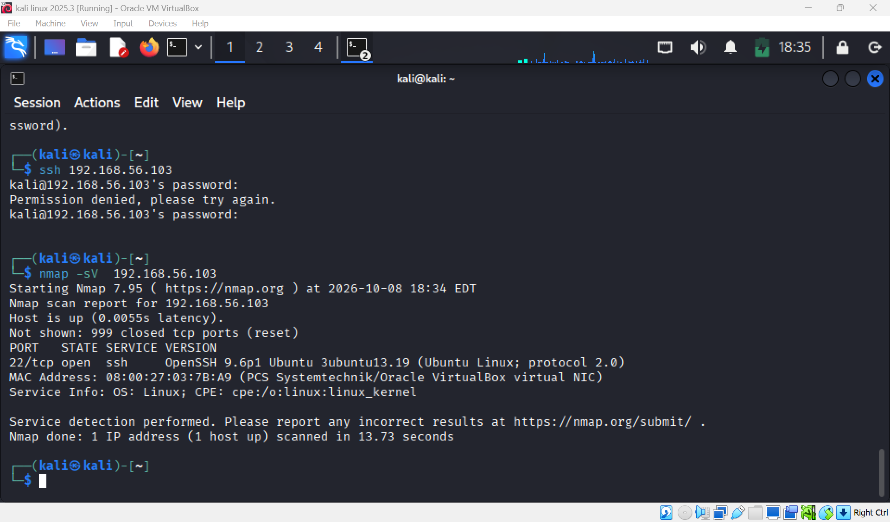
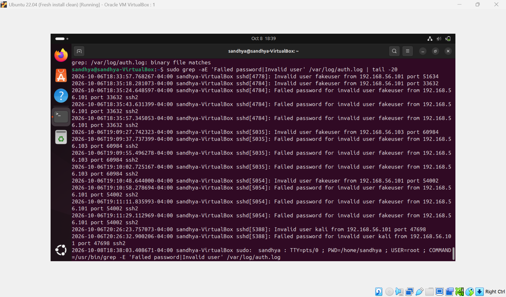

# SOC Lab — Evidence Collection

This directory contains screenshots collected during controlled security testing in the Attack-to-Detection SOC Lab.

The evidence supports reconnaissance analysis, SSH authentication monitoring, and Linux account discovery investigation.

## 1. Network Reconnaissance — Nmap

**Activity:** Network service enumeration from Kali Linux (`192.168.56.101`) against Ubuntu (`192.168.56.103`).

**Tool:** Nmap

**Objective:** Identify exposed network services, including SSH on TCP port 22.

**MITRE ATT&CK:** T1046 — Network Service Discovery

## 2. SSH Authentication Failure Analysis

**Activity:** Analysis of failed SSH authentication attempts against the Ubuntu endpoint.

**Log source:** `/var/log/auth.log`

**Observed indicators:**
- Invalid username: `fakeuser`
- Source IP: `192.168.56.101`
- Repeated failed authentication events

**Detection logic:** Five or more failed authentication attempts from the same source IP within the defined observation period.

**MITRE ATT&CK:** T1110 — Brute Force

**Investigation finding:** The previously documented simulation generated 12 failed or invalid authentication attempts. The detection threshold was exceeded; no automated SIEM alert is claimed.

## 3. Linux Account Discovery — auditd

**Activity:** Monitoring access to local Linux account information.

**Telemetry source:** Linux Audit Framework (`auditd`)

**Monitored files:**
- `/etc/passwd`
- `/etc/group`

**Detection key:** `account_discovery`

**MITRE ATT&CK:** T1087.001 — Account Discovery: Local Account

**Investigation finding:** Audit events recorded access to monitored account-information files, providing evidence for endpoint investigation.

---

## Evidence Handling

All activities were performed in an isolated, authorized VirtualBox home lab.

Screenshots are included to demonstrate the collection and interpretation of security telemetry. Detection findings were validated through manual log analysis rather than automated SIEM alerting.
